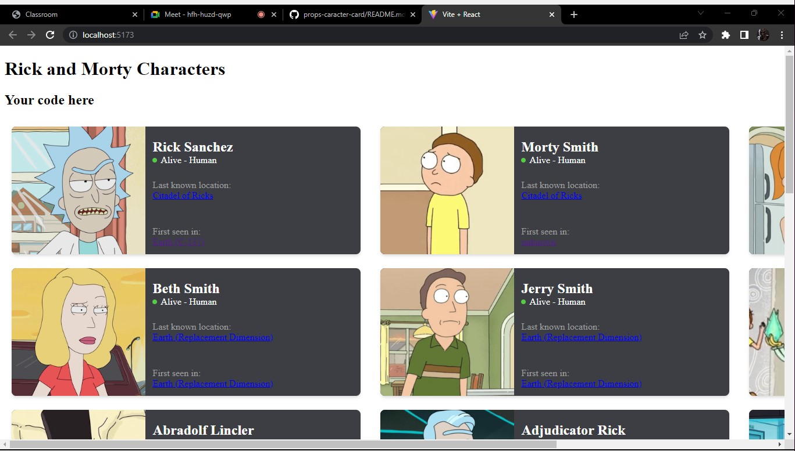

# Make It Real - Props caracter card

This is a solution to the props-caracter-card project of the Make It Real course.

## Table of contents

- [Overview](#overview)
  - [The challenge](#the-challenge)
  - [Screenshot](#screenshot)
- [My process](#my-process)
  - [Built with](#built-with)
  - [What I learned](#what-i-learned)
  - [Continued development](#continued-development)
  - [Useful resources](#useful-resources)
- [Author](#author)
- [Acknowledgments](#acknowledgments)

## Overview

### The challenge

- create a react project that allows to display the first 20 characters of the series using the same component called CharacterCard.jsx, this component must have its respective prop-types

### Screenshot

## My process

### Built with

- Semantic HTML5 markup
- CSS custom properties
- PropTypes
- React props

### What I learned

I learned abot proptypes en react and how to use it

### Continued development

-React proptypes

- [resource 1]((https://legacy.reactjs.org/docs/typechecking-with-proptypes.html)) - This helped to understand proptypes

## Author

- Website - [Michael]([https://www.your-site.com](https://github.com/Mike2020x))

